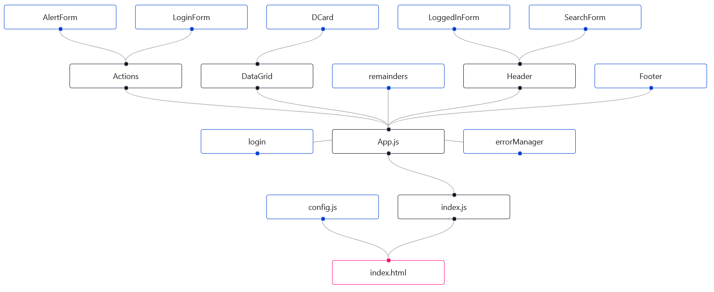

# Remainder Frontend

## Loki edistymisestä

### 12.10.

- vastaanotettu työkannettava
- ympäristön asentelu
- alkukokeilu datan saamiseksi, useEffect-funktio ei VSCoden mielestä ole funktio, syy epäselvä

### 13.10.

- eslint ja airbnb-base asennettu
- kokeillaan ohjaajan aiempaa runkoa
- funktio ei edelleenkään ole funktio, syy epäselvä

### 14-15.10.

- työstetty karkeaa runkoa ulkoasulle
- funktio toimii
- simppeli rest
- TODO: selvitä, kuinka bootstrapissa toteutetaan ns. "juokseva" rivitys muistutuskorteille. Grid layout? https://getbootstrap.com/docs/4.4/components/card/#grid-cards

### 19.10.

- muistutuskortit näkyvät kuin pitääkin
- aloitettu karkea hakutoiminnon toteutus
- Header ja Footer placeholderina
- TODO: kirjautuminen

### 22.10.

- haku toimii
- login seuraavaksi

### 26.10.

- login toimii
- localstorage seuraavaksi

### 29.10.

- muotoilua
- localstorage parempi
- alertit toimii suurelta osin. Onnistuneen ilmoituksen viivekatkaisu ei toiminut, jätetään sikseen toistaiseksi
- taustakuva lisätty
- haku siirretty headeriin
- lisätty painike uloskirjautumiseen

### 2.11.

- renderöintitestejä
- osa testeistä vaikuttaa pelkistetyltä. TODO: selvitä lisää testitavoista, yritä saada monipuolisuutta
- TODO: selvitä kirjautumisen ja hakemisen toiminnallisuuden testausmahdollisuudet

## Yleistä

Remainders on Riverian muistutusten selaukseen tarkoitettu sovellus. 

## Käyttö

Ohjelma vaatii hyväksytyn käyttäjänimen ja salasanan. Nämä ovat saatavissa järjestelmänvalvojalta. 
Oletuksena ohjelma näyttää 25 viimeisintä muistutusta.

### Haku

Haku tapahtuu kirjoittamalla kenttään kriteeri ja painamalla "Hae". Ohjelma hakee osumia muistutusten lähettäjän sähköpostiosoitteen perusteella.

## Rakenne

Ohjelman komponentit ovat kansiossa *components*. Pääkomponentteina ovat *Actions*, *DataGrid*, *Header* ja *Footer*.

### Actions

Tämä komponentti sisältää alikomponentit *AlertForm* ja *LoginForm*. Loginformilla käsitellään kirjautuminen, toiminnan tuloksesta visuaalinen palaute Alertformiin: onnistuminen vihreällä taustalla, epäonnistuminen punaisella.

### DataGrid

Tähän komponenttiin tulostetaan muistutukset *DCard*-komponentin mukaisesti.

### Header

Tämä komponentti huolehtii hausta *SearchForm*-komponentilla. Lisäksi komponenttiin on liitetty *logout()*-funktio, jonka avulla kirjaudutaan ulos.

### Footer

Tässä komponentissa 